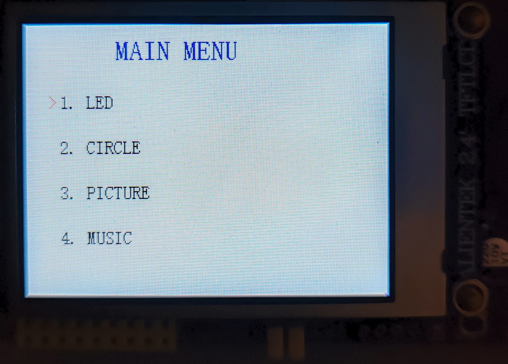
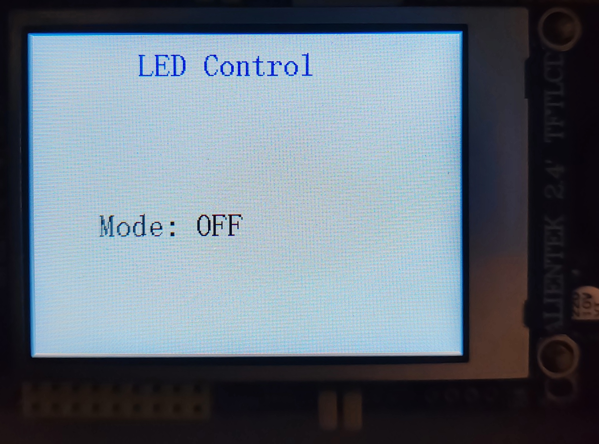
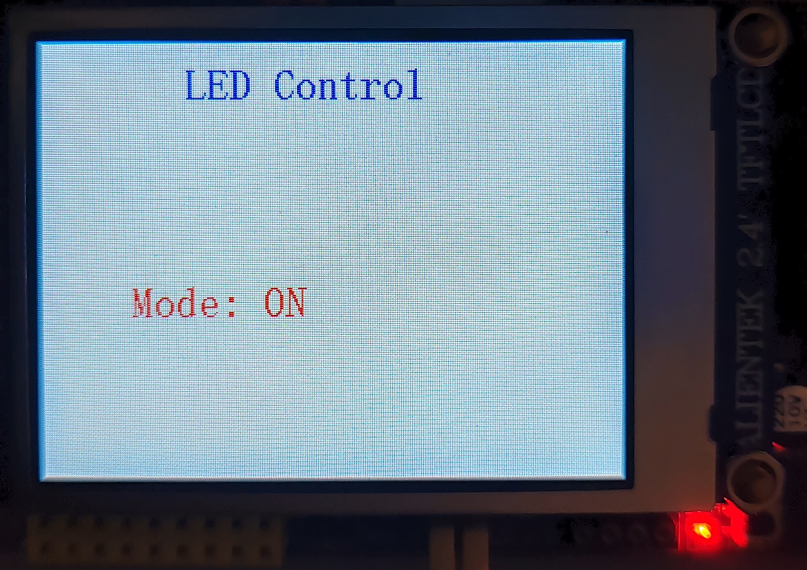
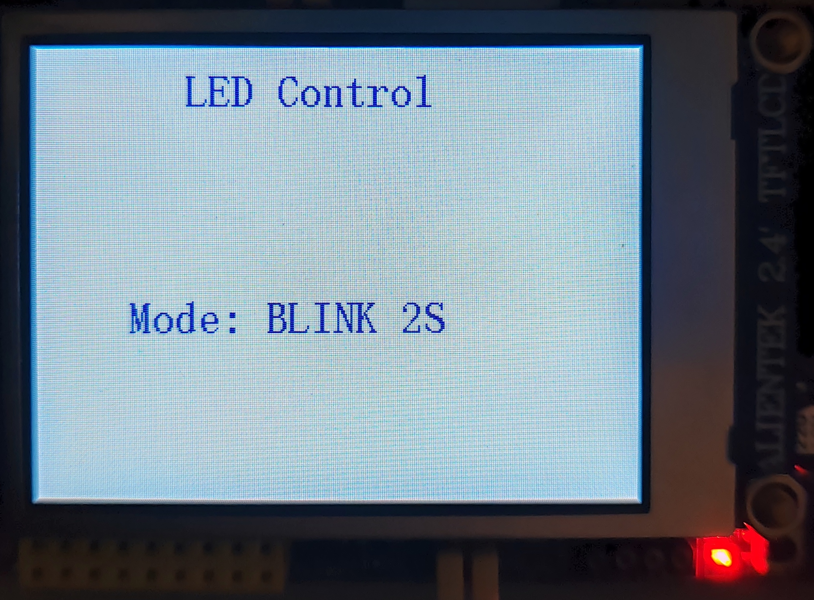
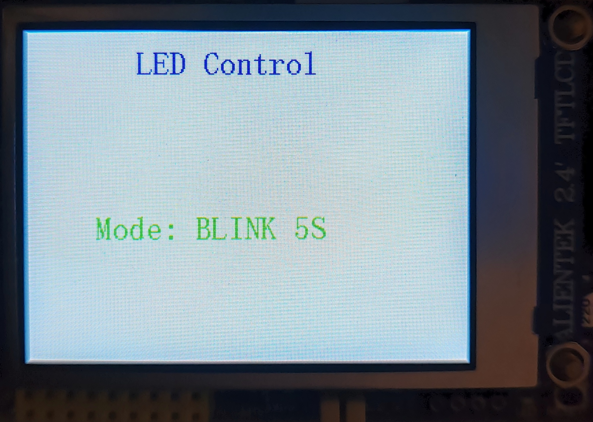
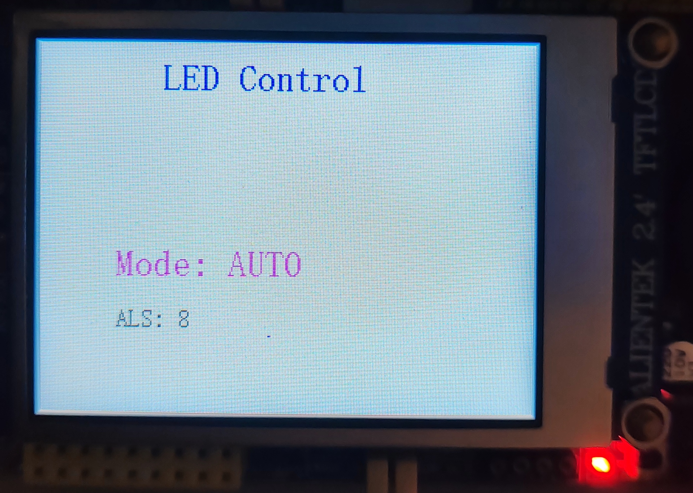
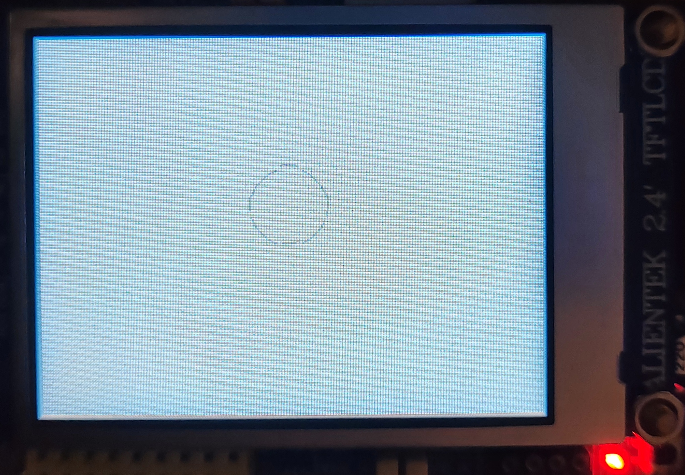
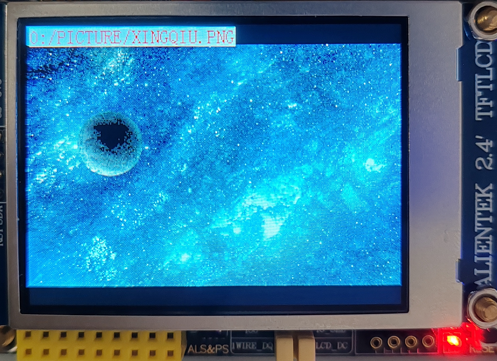
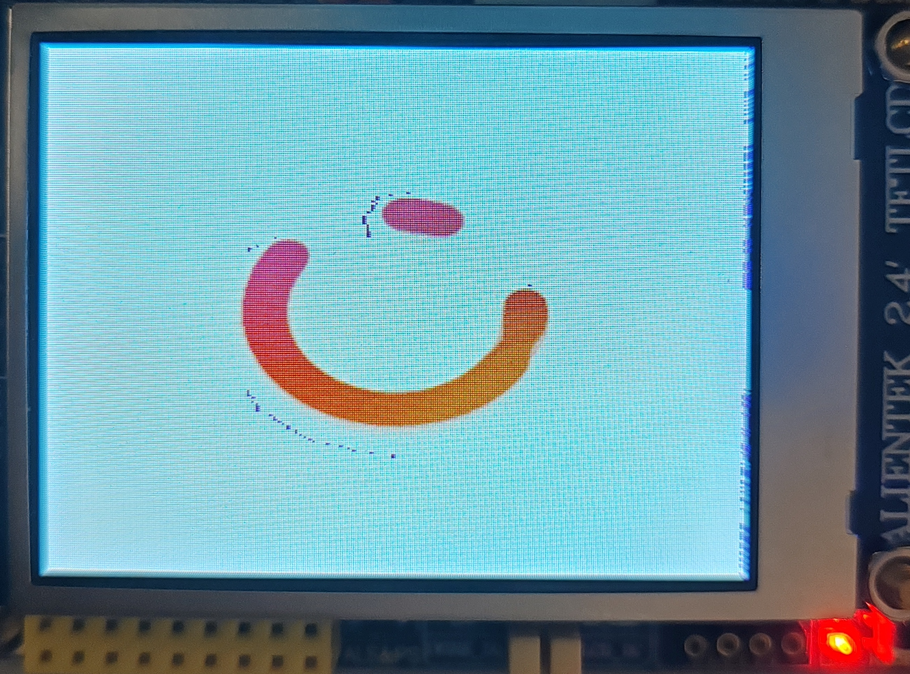
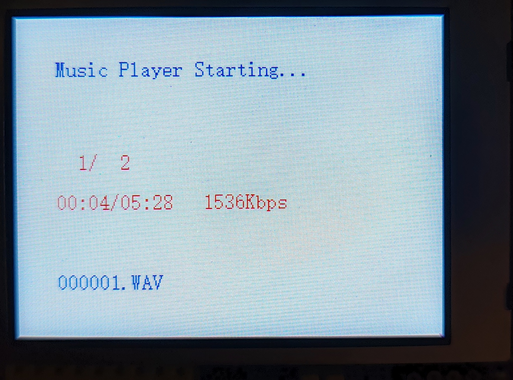

# ESP32-S3 智能终端 — MQTT 云控 + 多传感器交互

基于 ESP32-S3 的嵌入式物联网项目，实现本地多级菜单交互与 OneNET 云平台远程控制的智能终端。

## 目录

- [功能概述](#功能概述)
- [硬件平台](#硬件平台)
- [项目结构](#项目结构)
- [功能模块](#功能模块)
- [快速开始](#快速开始)
- [使用说明](#使用说明)
- [演示效果](#演示效果)

## 功能概述

| 功能 | 描述 |
|------|------|
| 主菜单 | 4 级菜单：LED 控制 / 圆形物理模拟 / 图片浏览 / 音乐播放 |
| LED 控制 | 5 种模式：关、开、2秒闪烁、5秒闪烁、光照自动调光 |
| 圆形模拟 | 基于 IMU 姿态角的屏幕滚球，含加速度/阻尼/回中力物理模型 |
| 图片浏览 | SD 卡读取 JPEG/BMP 图片，按键翻页浏览 |
| 音乐播放 | WAV 音频播放，支持上/下一首、暂停/播放 |
| 云端控制 | OneNET MQTT 远程切换屏幕、远程控制 LED |
| 数据上报 | 定时上报光照强度、IMU 姿态角、LED 状态到云平台 |

## 硬件平台

- **主控**：ESP32-S3
- **屏幕**：2.4 寸 ST7789 SPI LCD（320×240）
- **传感器**：AP3216C 光照传感器、QMA6100P 三轴加速度计
- **音频**：ES8388 编解码器 + 喇叭
- **存储**：MicroSD 卡（SPI）
- **外设**：5 个实体按键（通过 XL9555 GPIO 扩展芯片）

## 项目结构

```
ESP32-MQTT/
├── components/
│   ├── board/               # 板级初始化（I2C/SPI/XL9555/电源控制）
│   ├── bus_drivers/         # 总线驱动
│   ├── devices/             # 外设驱动
│   │   └── LCD/             # ST7789 LCD 驱动（含字库）
│   └── Middlewares/         # 中间件（FATFS 文件系统等）
├── main/
│   ├── main.c               # 入口：初始化 + 创建所有 FreeRTOS 任务
│   └── APP/
│       ├── MENU/            # 菜单系统 & 按键分发
│       ├── LED/             # LED 任务 & 模式管理
│       ├── CIRCLE/          # 滚球物理模拟
│       ├── MQTT/            # OneNET MQTT 通信
│       ├── ALS/             # 光照传感器任务
│       ├── IMU/             # 加速度计任务
│       ├── KEY/             # 按键扫描任务
│       ├── LCD/             # LCD 显示任务 & 界面绘制
│       ├── PIC/             # 图片浏览
│       └── AUDIO/           # 音频播放
└── partitions-16MiB.csv     # 分区表
```

## 功能模块

### 1. 菜单系统 (`main/APP/MENU/`)

- 5 屏状态机：主菜单 / LED 控制 / 圆形 / 图片 / 音乐
- 按键导航：上下选择 + 确认进入 + 返回
- 云端命令队列：MQTT 云端指令通过 FreeRTOS 队列异步投递，不阻塞网络任务

### 2. LED 控制 (`main/APP/LED/`)

| 模式 | 行为 |
|------|------|
| OFF | 熄灭 |
| ON | 常亮 |
| BLINK 2S | 2 秒周期闪烁 |
| BLINK 5S | 5 秒周期闪烁 |
| AUTO | ALS < 200 自动亮，≥200 自动灭，LCD 实时刷数值 |

### 3. 圆形物理模拟 (`main/APP/CIRCLE/`)

- 读取 QMA6100P 加速度计的 Roll/Pitch 角度
- 角度 → 加速度 → 积分速度 → 积分位置
- 含死区、阻尼 (0.99)、回中力、边界反弹
- 50ms 刷新一次，使用 Bresenham 圆算法绘制

### 4. MQTT 云通信 (`main/APP/MQTT/`)

- WiFi 自动配网 + 断线重连（最多 5 次）
- 连接 OneNET 平台，订阅属性设置主题
- 每 5 秒上报一次传感器数据（ALS / IMU 姿态 / LED 状态）
- 云端下发指令：切换屏幕、设置 LED 模式
- 先回复后执行：防止 LCD 操作耗时导致 OneNET 命令超时

### 5. 传感器

| 传感器 | 型号 | 接口 | 数据 |
|--------|------|------|------|
| 光照 | AP3216C | I2C | ALS 值 (0-65535) |
| 加速度计 | QMA6100P | I2C | Pitch / Roll 角度 |

### 6. 其他

- **图片浏览**：从 SD 卡读取 JPEG/BMP，按键翻页
- **音乐播放**：I2S + ES8388 + WAV 解码，支持播放控制

## 快速开始

### 环境要求

- ESP-IDF v5.3.3
- ESP32-S3 开发板

### 编译与烧录

```bash
# 1. 激活 ESP-IDF 环境
. $IDF_PATH/export.sh          # Linux/macOS
%IDF_PATH%\export.bat          # Windows

# 2. 克隆项目
git clone <你的仓库地址>
cd ESP32-MQTT

# 3. 配置 WiFi 和 OneNET（编辑 main/APP/MQTT/onenet_demo.h）
#    - WIFI_SSID / WIFI_PASS：你的 WiFi 账号密码
#    - PRODUCT_ID / DEVICE_ID / DEVICE_TOKEN：OneNET 平台设备信息

# 4. 编译
idf.py build

# 5. 烧录 + 监视
idf.py -p COM3 flash monitor    # COM3 换成你的串口号
```

### OneNET 云平台配置

1. 注册 [OneNET 平台](https://open.iot.10086.cn/)
2. 创建产品（MQTT 协议）
3. 添加设备，获取产品 ID、设备名称、设备 Token
4. 填入 `onenet_demo.h` 中对应的宏定义
5. 在 OneNET 控制台配置物模型属性：`LED_MODE`(int) 和 `SCREEN`(int)

## 使用说明

### 按键映射

| 按键 | 功能 |
|------|------|
| KEY0 | 图片/音乐：播放/暂停 |
| KEY1 | 菜单：向下 / LED：下一模式 / 图片：下一张 / 音乐：下一首 |
| KEY2 | 返回主菜单 |
| KEY3 | 菜单：向上 / LED：上一模式 / 图片：上一张 / 音乐：上一首 |
| BOOT | 确认进入 |

### 云端控制

在 OneNET 控制台下发 JSON 命令：

```json
// 切换到圆形界面（0=主菜单, 1=LED, 2=圆形, 3=图片, 4=音乐）
{"SCREEN": 2}

// 设置 LED 为闪烁模式
{"LED_MODE": 2}
```

### LED 模式编号

| 值 | 含义 |
|----|------|
| 0 | OFF |
| 1 | ON |
| 2 | BLINK 2S |
| 3 | BLINK 5S |
| 4 | AUTO |

## 演示效果
- 主菜单通过 LCD 显示，按键切换高亮选项



- LED 可进入自动亮度模式，根据环境光强度自动开关

    

- 姿态球利用加速度计数据实现随板子倾斜移动的圆球效果



- 图片浏览支持 GIF 动画

 

- 音乐播放时显示曲目名、播放时间、比特率



（可在"演示"文件夹中查看完整演示视频/移动oneNET平台截图）
